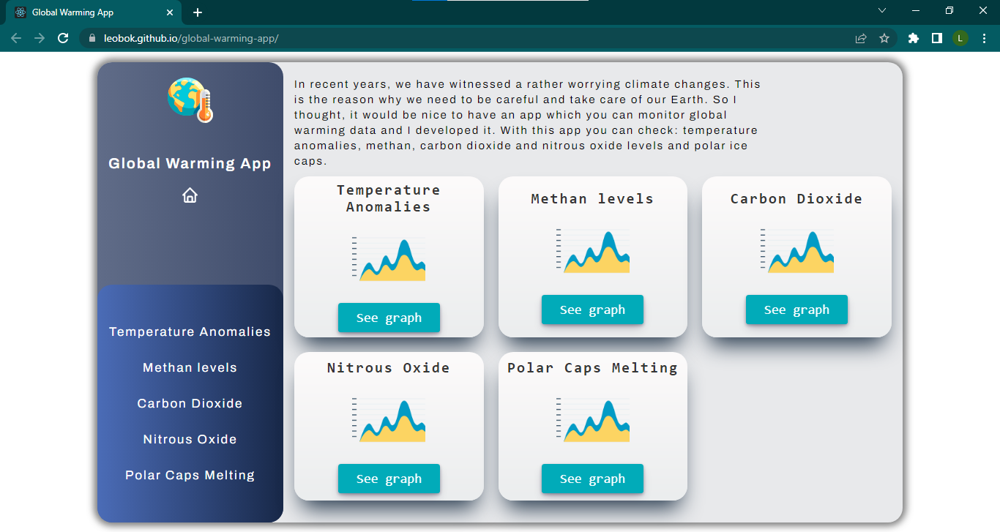
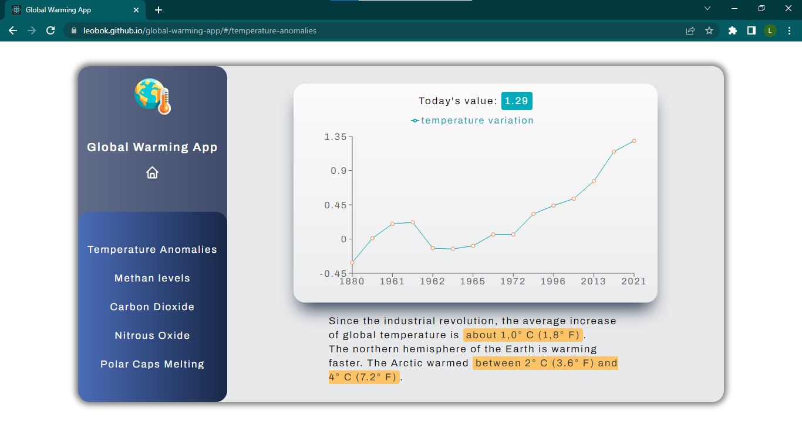

<h1 align="center">Global Warming App</h1>

With this app, you can monitor global warming data.
    you can check: temperature anomalies, methan, carbon dioxide and nitrous oxide levels and polar ice caps.

## 📎 Links

- [Repo](https://github.com/LeoBok/global-warming-app "Global Warming App Repo")

- [Live](https://leobok.github.io/global-warming-app/ "Live Project")

- [API](https://global-warming.org/ "API")

## 📷 Screenshots

